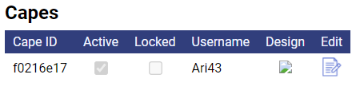

# Temporary Issues 

## Broken Cape 
1. Direct the user to open an OptiFine support ticket (Discord channel: `<#904875214112956497>`). Only sp614x can fix this issue. 

### Causes
- The user moved their cape to another Minecraft username 
- The user changed their Minecarft username, causing the cape to be moved automatically 

### Notes
- Because only sp614x can fix this and the large number of broken capes, getting them fixed may take a significant amount of time. 
- If the user doesn't see their cape's image (example below) when they are [signed in](https://optifine.net/login), the cape is broken. If the user *can* see their cape, that doesn't necessarily mean it's working.  

- While changing the cape design doesn't seem to cause this, it's not reccomended. 

## Current Website Issues.
- If the user is having cape issues, refer to [Broken Cape](#Broken-Cape).
- Several reloads may be required to access some pages.

